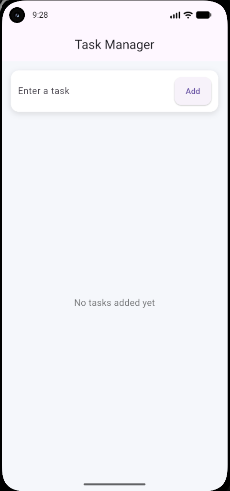
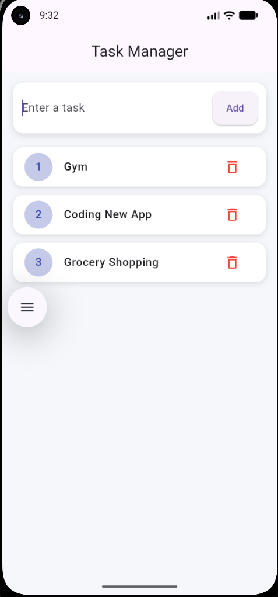

# 📱 Task Manager App

A simple and clean task manager app built using Flutter.

I built this project to practice Flutter development and understand how real mobile apps handle basic task operations like adding, updating, and deleting tasks.

---

## 🚀 Features

- Add new tasks  
- Edit existing tasks  
- Delete tasks  
- Mark tasks as completed  
- Clean and easy-to-use interface  

---

## 🛠 Tech Used

- Flutter  
- Dart  

---

## 📸 App Screenshots




---

## ▶️ How to Run This Project

1. Clone the repository:
   ```bash
   git clone https://github.com/Sandeep2002jha/task-manager-app.git

2. Go to the project folder:
      cd task-manager-app

3. Install dependencies:
      flutter pub get

4. Run the app:
      flutter run

🎯 Why I Built This

I wanted to get hands-on experience with Flutter and understand how apps manage data and user interactions.
This project helped me learn about UI structure, basic logic building, and how a real app flow works.

🔗 GitHub

https://github.com/Sandeep2002jha/task-manager-app

